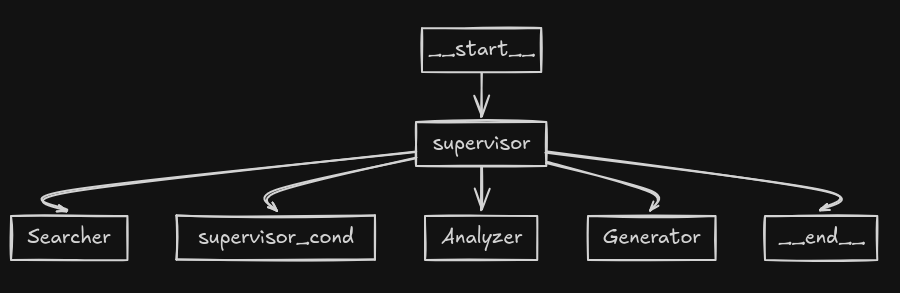

# ClutchCV

ClutchCV is a simple AI agent designed to enhance job searching on LinkedIn. By utilizing the LinkedIn API, it automates the process of finding suitable job matches based on the user's resume and even writes cover letters for the best matches. Currently, it supports a few key use cases.

### Installation

```pip install -r requirements.txt```

### Usage

These environment variables are required:

```
OPENAI_API_KEY=<OPENAI_API_KEY>
LINKEDIN_EMAIL=<LINKEDIN_EMAIL>
LINKEDIN_PASS=<LINKEDIN_PASS>
LANGCHAIN_API_KEY=<LANGSMITH_KEY>
LANGCHAIN_TRACING_V2=true
LLM_NAME=<LLM_NAME> groq/openai
```

Then run on terminal:
```streamlit run app.py```

Currently works well only with OpenAI GPT-4. 


